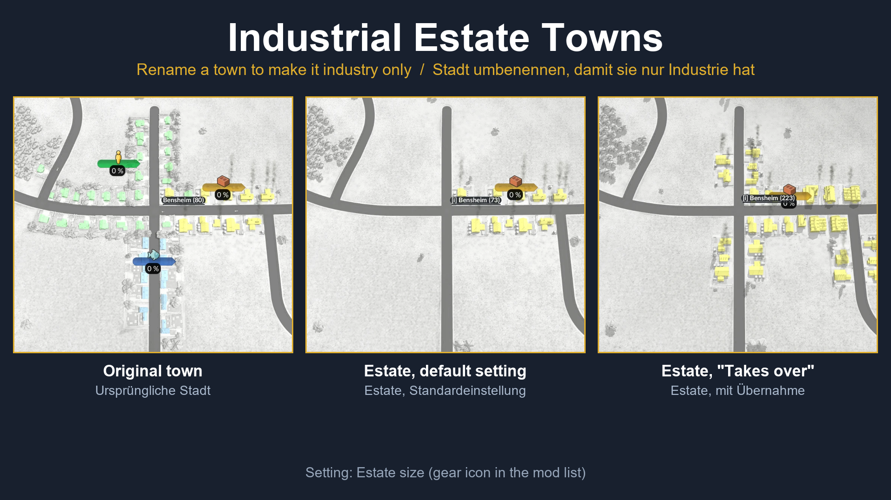

# Industrial Estate Towns (Transport Fever 3)

**EN** | [DE](#deutsch)

**Get it in the in-game Mod Hub** (mod.io): [Industrial Estate Towns](https://mod.io/g/transportfever3/m/industrial-estate-towns)

A script mod for Transport Fever 3. Rename a town so that its name starts with a keyword, and the town becomes an **industrial estate**: no housing, no commerce, only industry. Remove the keyword again and the town gets its housing and commerce back. All other towns stay as they are.

**Please test it in a new game or on a copy of your savegame first, and tell me how it works for you** (see [Feedback](#feedback)).

## How to use

1. Open the town window and click the pencil to rename the town.
2. Start the new name with one of the keywords (case does not matter):

   | Keyword | Examples |
   |---|---|
   | `indus` | `Industrial Estate North`, `Industry Park`, `Industriegebiet Ost`, `industrie 3` |
   | `fabrik` | `Fabrikstadt` |
   | `factory` | `Factory Row` |
   | `[i]`, `[ind]`, `#ind` | `[i] Harbour`, `[ind]Nord`, `#ind West` |

3. Within a few seconds the green and blue buildings of that town are removed. Only the yellow industrial buildings stay.
4. To turn it back into a normal town, remove the keyword from the name. Housing and commerce return within seconds.

Only the **start** of the name counts. A single `i` or `ind` is not a keyword, so towns like "Immenstadt" or "Indersdorf" are not affected. If the first letters of one of your towns happen to match a keyword, rename it.

## Setting: Estate size

In the mod settings (gear icon) you can choose how big the estate becomes:

- **As before (keep the small zone)**, the default: the industrial zone keeps its own size, so the town gets much smaller.
- **Takes over the space of the other two zones**: the industrial zone gets the space of all three zones of that town. The town keeps about its old size. The setting is read when the game starts, so change it before loading the game.

## What to expect

- The industrial zone of an estate **grows when you supply it**, like any town (observed with an earlier version of the mod: a town without residents grew after its industry demand was served).
- Industries on the map spawn as usual.
- If you remove the keyword, the town gets back the values it had before. If the mod did not know them (for example because the mod was switched off in between), the zones come back with the typical size of the other towns of the map (the median of every zone). If the map has no such town, a fixed ratio based on the industrial zone is used (about 1.4 housing and 1.0 commerce per industry).
- If you switch the mod off, estates stay industry only. The game runs normally. If you switch the mod on again, a town that has neither housing nor commerce and no keyword in its name is restored automatically. This also applies to such towns made by other tools.

## Install

Open the **Mod Hub** in the game, search for "Industrial Estate Towns" and subscribe. Then start a game and activate the mod when you create it, or add it to an existing savegame (try a copy first). This repository holds the source code and is the place for feedback; the mod is meant to be installed through the Mod Hub.

## How it works

- `content/industrial_estate_towns.gs.lua` and `.script.tl`: a game script that checks the names of all towns every 5 seconds (`api.engine.util.getEntityName`).
- For a town with a keyword it sets the initial land-use capacity of housing and commerce to 0 (`makeTownSetInitialLandUseCapacitiesCmd`) and asks the town to update its buildings (`makeTownUpdateSizeCmd`) so the green and blue buildings are removed at once. It remembers the original values in the script state, which is saved with the savegame.
- When the keyword is gone, it writes the remembered values back and lets the town rebuild.
- The game drops the script state when a savegame is loaded without the mod. That is why a town without keyword and with both zones at 0 is restored with the standard values.

## Tested

Tested on Transport Fever 3, build 40408, with a 13 town test savegame and a second savegame with two estates:
- Making a town an industrial estate and back, repeatedly, also with the mod switched off and on in between.
- Almost one hour of play with two estates and normal towns, with speed-up, without errors.
- Changing the wanted goods of an industrial estate: stable.
- Saving, quitting and loading again, with and without the mod.
- Version 2 (setting "Estate size"): both settings, "Takes over" gives a visibly bigger zone; old savegames made with version 1 load fine, estates stay and restored towns come back with the median size of the map; used together with the residential and commercial estate mods.

Not tested: other mods that change town growth or town names, and very large maps.

## Feedback

Please use [Issues](../../issues) for bugs and [Discussions](../../discussions) for feedback and ideas. Helpful details: game build, other active mods, the name of the town, what you did before, and the `stdout.txt` from your `crash_dump` folder if the game crashed.

## License

MIT, see [LICENSE](LICENSE).

---

## Deutsch

**Im Spiel über den Mod-Hub laden** (mod.io): [Industrial Estate Towns](https://mod.io/g/transportfever3/m/industrial-estate-towns)

Ein Script-Mod für Transport Fever 3. Benenne eine Stadt so um, dass ihr Name mit einem Stichwort beginnt, und die Stadt wird zum **Industriegebiet**: kein Wohnen, kein Gewerbe, nur Industrie. Entfernst du das Stichwort wieder, bekommt die Stadt Wohnen und Gewerbe zurück. Alle anderen Städte bleiben unverändert.

**Bitte zuerst in einem neuen Spiel oder mit einer Kopie deines Spielstands testen und mir Rückmeldung geben** (siehe [Feedback](#feedback-1)).

### So geht's

1. Das Stadtfenster öffnen und mit dem Stift die Stadt umbenennen.
2. Den neuen Namen mit einem der Stichwörter beginnen (Groß- und Kleinschreibung egal):

   | Stichwort | Beispiele |
   |---|---|
   | `indus` | `Industrial Estate North`, `Industry Park`, `Industriegebiet Ost`, `industrie 3` |
   | `fabrik` | `Fabrikstadt` |
   | `factory` | `Factory Row` |
   | `[i]`, `[ind]`, `#ind` | `[i] Hafen`, `[ind]Nord`, `#ind West` |

3. Nach wenigen Sekunden sind die grünen und blauen Gebäude der Stadt abgebaut. Nur die gelben Industriegebäude bleiben.
4. Um wieder eine normale Stadt zu bekommen, das Stichwort aus dem Namen entfernen. Wohnen und Gewerbe kommen innerhalb von Sekunden zurück.

Es zählt nur der **Anfang** des Namens. Ein einzelnes `i` oder `ind` ist kein Stichwort, Städte wie „Immenstadt“ oder „Indersdorf“ sind also nicht betroffen. Passen die ersten Buchstaben einer deiner Städte zufällig zu einem Stichwort, benenne sie um.

### Einstellung: Estate size

In den Mod-Einstellungen (Zahnrad) kannst du wählen, wie groß das Gebiet wird:

- **As before (keep the small zone)**, Standard: Die Industriezone behält ihre eigene Größe, die Stadt wird dadurch deutlich kleiner.
- **Takes over the space of the other two zones**: Die Industriezone bekommt den Platz aller drei Zonen der Stadt. Die Stadt behält ungefähr ihre alte Größe. Die Einstellung wird beim Spielstart gelesen, also vor dem Laden des Spiels ändern.

### Was du erwarten kannst

- Die Industriezone eines Industriegebiets **wächst, wenn du sie versorgst**, wie bei jeder Stadt (beobachtet mit einer früheren Version des Mods: Eine Stadt ohne Einwohner wuchs, nachdem ihr Industriebedarf erfüllt wurde).
- Industrien auf der Karte entstehen wie gewohnt.
- Entfernst du das Stichwort, bekommt die Stadt die Werte von vorher zurück. Kennt der Mod sie nicht (zum Beispiel weil er zwischendurch ausgeschaltet war), kommen die Zonen in der typischen Größe der anderen Städte der Karte zurück (Median jeder Zone). Gibt es auf der Karte keine solche Stadt, gilt ein festes Verhältnis zur Industriezone (etwa 1,4 Wohnen und 1,0 Gewerbe je Industrie).
- Schaltest du den Mod aus, bleiben Industriegebiete reine Industrie. Das Spiel läuft normal. Schaltest du ihn wieder ein, wird eine Stadt ohne Wohnen und Gewerbe und ohne Stichwort im Namen automatisch wiederhergestellt. Das gilt auch für solche Städte aus anderen Werkzeugen.

### Installation

Im Spiel den **Mod-Hub** öffnen, nach „Industrial Estate Towns“ suchen und abonnieren. Dann ein Spiel starten und den Mod beim Anlegen aktivieren oder ihn zu einem bestehenden Spielstand hinzufügen (zuerst an einer Kopie probieren). Dieses Repository enthält den Quellcode und ist der Ort für Rückmeldungen. Der Mod ist dafür gedacht, über den Mod-Hub installiert zu werden.

### Getestet

Getestet mit Transport Fever 3, Build 40408, mit einem Testspielstand mit 13 Städten und einem zweiten Spielstand mit zwei Industriegebieten:
- Eine Stadt zum Industriegebiet machen und zurück, mehrfach, auch mit zwischendurch aus- und eingeschaltetem Mod.
- Knapp eine Stunde Spielzeit mit zwei Industriegebieten und normalen Städten, mit Zeitraffer, ohne Fehler.
- Den gewünschten Bedarf eines Industriegebiets ändern: stabil.
- Speichern, Beenden und Neuladen, mit und ohne Mod.
- Version 2 (Einstellung „Estate size“): beide Einstellungen, „Takes over“ ergibt eine sichtbar größere Zone; alte Spielstände aus Version 1 laden problemlos, Gebiete bleiben bestehen und wiederhergestellte Städte kommen mit der Median-Größe der Karte zurück; zusammen mit den Residential- und Commercial-Estate-Mods benutzt.

Nicht getestet: andere Mods, die Stadtwachstum oder Städtenamen ändern, und sehr große Karten.

### Feedback

Bitte [Issues](../../issues) für Fehler und [Discussions](../../discussions) für Rückmeldungen und Ideen nutzen. Hilfreich sind: Spiel-Build, andere aktive Mods, der Name der Stadt, was du kurz vorher getan hast, und die `stdout.txt` aus dem Ordner `crash_dump`, falls das Spiel abgestürzt ist.

### Lizenz

MIT, siehe [LICENSE](LICENSE).
